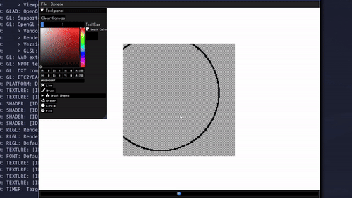

# Pixelater 

<b> Pixelater - is a free and open-source pixel art software. Developed with C++, Raylib graphics lib and ImGUI GUI lib. </b>

 *Currently the software tested only on Linux, all building settings are for Linux and compiles with Linux compiler flags.*

## Examples


## Usage
Build with CMake, Make
```
// from build folder run
cmake ..

// build exe with make
make

// run
./pixelater
```
